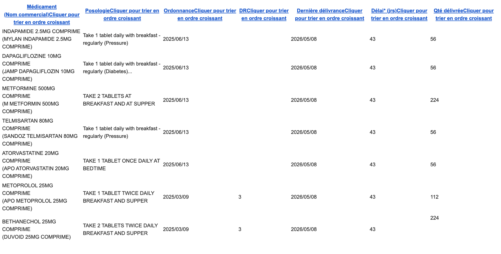
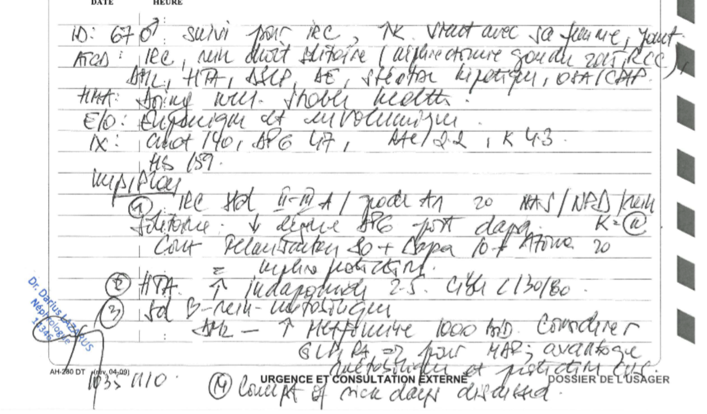
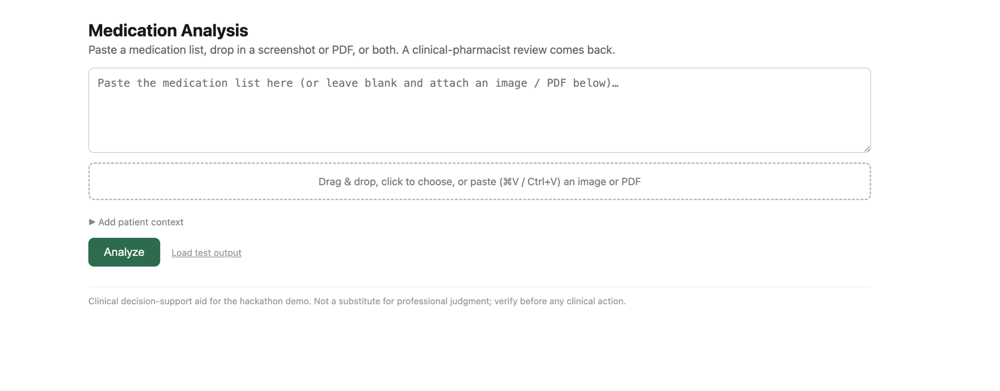
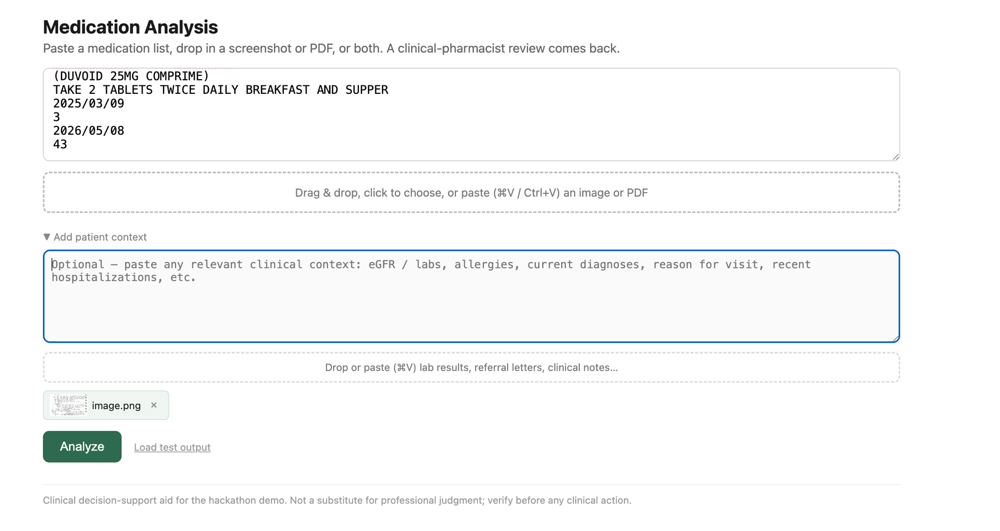
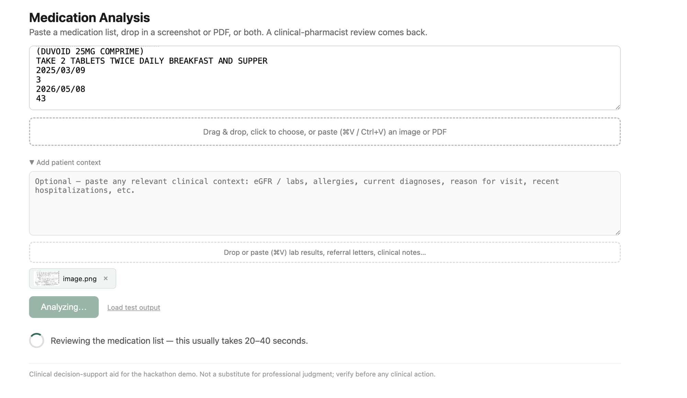
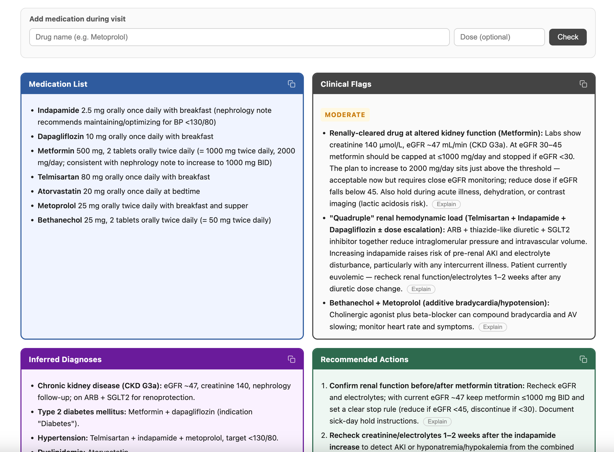
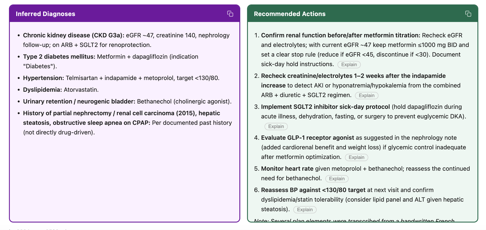
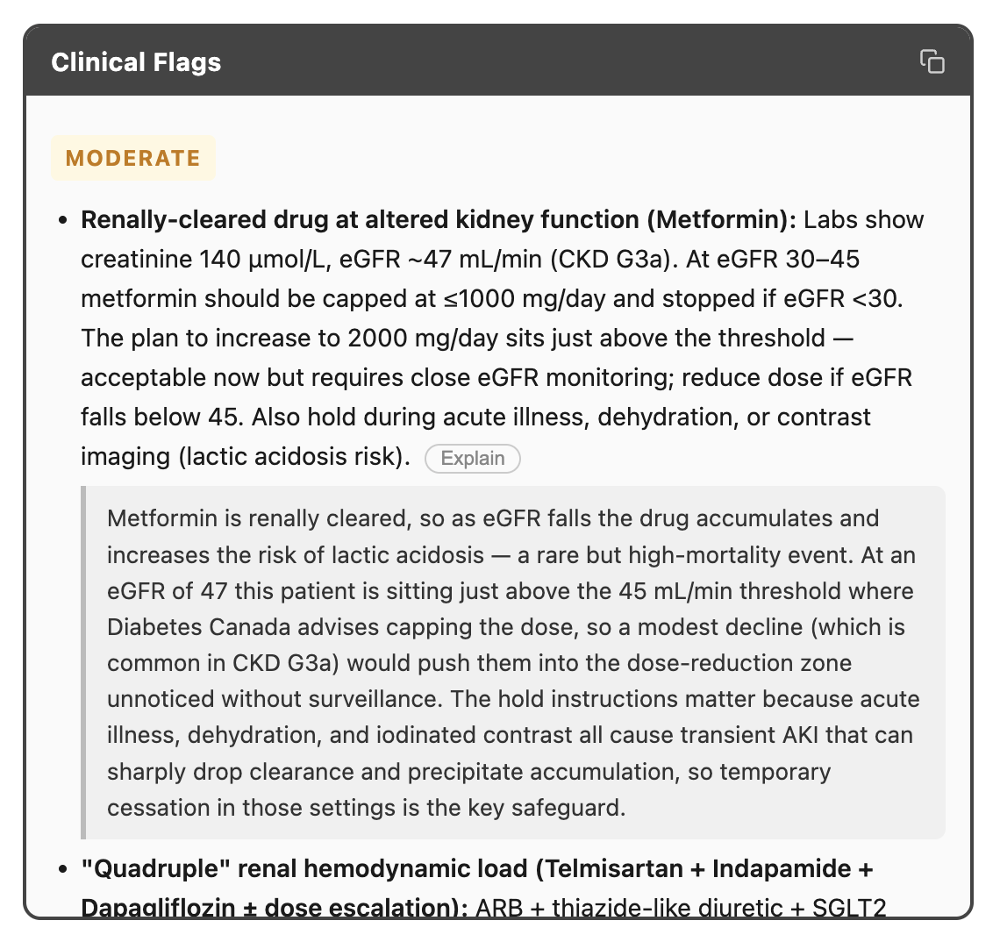

# Medication Analysis — AGI Health Hackathon

A no-login web app that takes a patient's active medication list — pasted text, a screenshot, a PDF, or any combination — and returns an expert clinical-pharmacist review. Physicians can also check a new drug mid-visit against the existing regimen, with RAMQ exception codes looked up automatically.

## Features

- **Multimodal input** — paste text, drop images, drop PDFs, or mix all three. Paste a screenshot with ⌘V.
- **Clinical-pharmacist review** — normalized medication list, interaction flags (Severe / Moderate / Mild), inferred diagnoses, and recommended actions. Powered by Claude Opus 4.8 with adaptive thinking.
- **Optional patient context** — attach lab results, referral letters, or handwritten clinical notes to sharpen the analysis.
- **Add medication during visit** — type any drug name (English or French) to get an instant interaction check against the reviewed regimen and the matching RAMQ exception codes.
- **RAMQ formulary lookup** — offline SQLite search across all 158 exception drugs and 242 codes. Bilingual: English or French input works; indication texts are returned in English. This is a bonus for Quebec practitioners

## How it works

```
paste text / drop image / drop PDF
  + optional patient context (labs, handwritten notes, referral letters)
        │
        ▼
   Flask server
        │
        ├─▶ Claude Opus 4.8 (vision + adaptive thinking)
        │         clinical-pharmacist system prompt
        │         ◀── 4-panel markdown review
        │
        └─▶ Add medication (mid-visit)
              │
              ├─▶ Haiku  — normalize drug name (EN/FR → both INNs)
              ├─▶ SQLite — RAMQ exception code lookup
              ├─▶ Haiku  — translate French indications to English
              └─▶ Opus   — interaction check against existing regimen
```

## Screenshots

### Input — the app accepts whatever you have

The medication list can be raw copy-paste from a pharmacy system (French headers, dates, quantities, noise included):



Patient context can be a photo of handwritten clinical notes:



### UI walkthrough

**Empty state**



**With messy copy-paste text and a handwritten note attached as context**



**Analyzing** (20–40 seconds with Opus 4.8 + adaptive thinking)



### Output — 4-panel clinical review

**Medication List + Clinical Flags** — normalized drug list extracted from raw input; flags colour-coded by severity with citations to the patient's own labs



**Inferred Diagnoses + Recommended Actions** — diagnoses inferred from the regimen cross-referenced with the clinical notes; prioritized action items with stop rules



**Explain** — click any flag or action to get a 2–3 sentence clinical explanation of the mechanism and the specific risk



## Setup

```bash
python3 -m venv .venv && source .venv/bin/activate
pip install -r requirements.txt
cp .env.example .env          # add your ANTHROPIC_API_KEY
```

## Run

```bash
PORT=5001 python -m app.server
# open http://localhost:5001
```

> macOS users: AirPlay occupies port 5000 by default, so the app runs on 5001.

## Layout

| Path | What |
|------|------|
| `app/analyze.py` | Claude calls: full analysis, drug check, EN/FR normalization, indication translation |
| `app/formulary.py` | SQLite FTS5 search over the RAMQ exception drug database |
| `app/server.py` | Flask routes (`/`, `/api/analyze`, `/api/check-drug`, `/api/explain`) |
| `app/prompts.py` | Versioned clinical-pharmacist system prompts |
| `app/templates/index.html` | Single-page UI |
| `data/ramq.db` | SQLite DB: 158 drugs, 242 exception codes (all 12 RAMQ sections) |
| `data/ramq_exception.pdf` | Source PDF (gitignored — download from RAMQ) |
| `scripts/build_formulary.py` | One-time PDF → SQLite extraction via Claude (streaming, resumable) |

## Notes

- Model: `claude-opus-4-8` for analysis and interaction checks; `claude-haiku-4-5` for fast normalization and translation.
- Uploads capped at 30 MB.
- Clinical decision-support aid for demo purposes — not a substitute for professional judgment.
